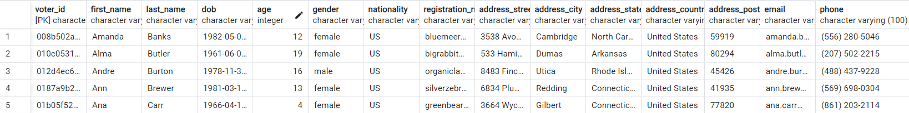
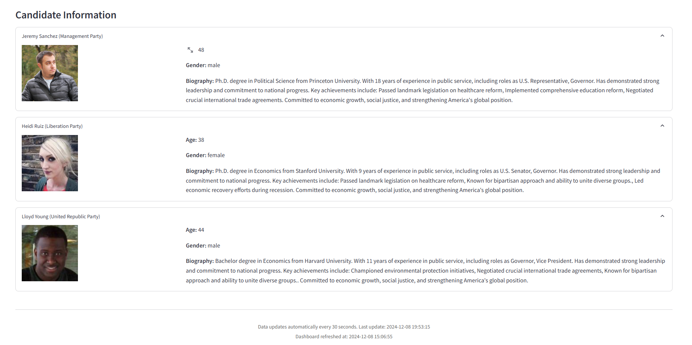

# Real Time Election Voting System
This repository is part of our group project for DS5110. We have chosen to develop a scalable, real-time voting system using big data technologies. We'll incorporate technologies like **Docker, Kafka, PostgreSQL, Python, Apache Spark, and Streamlit** to build a robust, scalable, live-updating voting platform. The system uses Docker Compose to quickly set up the needed services in Docker containers.

## System Architecture

- The system processes votes in real-time using **PostgreSQL for storage**, **Apache Kafka, Spark for processing, and Streamlit for visualization**.

## Database Schema

- **Candidate**: contains candidates information (**candidate_id**, dob, age, gender, first_name, last_name, biography, party, image_url)
- **Voter**: contains voters information (**voter_id**, dob, age, gender,registration_number, first_name, last_name, nationality, address, email, phone)
- **Vote**: contains vote information (**vote_id**, voter_id, candidate_id, voted_at)

## API
Voters information are gotton from Random User API: https://randomuser.me/

```bash Example
import requests

# Basic request - gets one random user
response = requests.get('https://randomuser.me/api/')
user = response.json()

# Get multiple users (e.g., 5 users)
response = requests.get('https://randomuser.me/api/?results=5')
users = response.json()

# Get specific fields and nationalities
response = requests.get('https://randomuser.me/api/?nat=us,gb&results=3&gender=female')
# This gets 3 female users from US or GB

# Example of accessing the data
for user in users['results']:
    print(f"Name: {user['name']['first']} {user['name']['last']}")
    print(f"Email: {user['email']}")
    print(f"Location: {user['location']['city']}, {user['location']['country']}")
    print("---")
```
## Project Overview

The project consists of three main components:

## Features
- 🗳️ Real-time vote counting and visualization
- 🗺️ Interactive US map showing state-by-state results
- 📈 Time series vote tracking
- 📋 Detailed state-level voting table
- 🔄 Auto-refreshing data every 5 seconds

## Technologies Used

- **Python 3.9**
- **Apache Kafka & Zookeeper**: Message streaming
- **Apache Spark**: Data processing
- **PostgreSQL**: Database
- **Streamlit**: Dashboard interface
- **Pandas & NumPy**: Data manipulation
- **Docker & Docker Compose**: Containerization

## Prerequisites

- [Docker](https://www.docker.com/get-started)
- [Docker Compose](https://docs.docker.com/compose/install/)
- [Python 3.9+](https://www.python.org/downloads/) (for local development)
- [Git](https://git-scm.com/downloads)
- [Anaconda](https://www.anaconda.com/download) (for virtual environment)
- [PostgreSQL](https://www.postgresql.org/download/)

## Project Structure
```bash
Voting-Dashboard/
├── docs/
├── images/
├── src/
│   ├── data_generator.py
│   ├── setup_database.py
├── app.py      # Streamlit dashboard
├── docker-compose.yml
├── environment.yml
└── README.md
```
## Getting Started (Using Docker & Anaconda)
**1. Setting up Environment file**
- Open Anaconda Prompt
- Navidate to your project directory
```bash
# Create the environment from the file
conda env create -f environment.yml

# Activate the environment
conda activate voting-system

# To deactivate an active environment, use
conda deactivate
```
- If you need to update the environment later
```bash
# After adding new packages to environment.yml
conda env update -f environment.yml --prune
```

**2. Setting up Docker Service**
- Make sure Docker Desktop is running first (you need to start Docker Desktop application)
- Open Anaconda Prompt and navigate to your project directory
```bash
# Start all services
docker-compose up -d

# Create topics
docker exec -it voting_kafka kafka-topics --create --bootstrap-server localhost:9092 --topic voters_topic --partitions 1 --replication-factor 1

docker exec -it voting_kafka kafka-topics --create --bootstrap-server localhost:9092 --topic candidates_topic --partitions 1 --replication-factor 1

docker exec -it voting_kafka kafka-topics --create --bootstrap-server localhost:9092 --topic votes_topic --partitions 1 --replication-factor 1

docker exec -it voting_kafka kafka-topics --create --bootstrap-server localhost:9092 --topic aggregated_votes_per_candidate --partitions 1 --replication-factor 1

docker exec -it voting_kafka kafka-topics --create --bootstrap-server localhost:9092 --topic aggregated_turnout_by_location --partitions 1 --replication-factor 1

# Verify topics were created
docker exec -it voting_kafka kafka-topics --list --bootstrap-server localhost:9092

# To stop services 
docker-compose down

# To restart services
docker-compose restart

# Remove everything including volumes (clean start)
docker-compose down -v

```

**3. Verify PostgreSQL**
```bash
# Connect to PostgreSQL
docker exec -it voting_postgres psql -U postgres -d voting

# You should see the PostgreSQL prompt: voting=#
# Type \q to exit

# Restart PostgreSQL if needed
docker-compose restart postgres

# Check PostgreSQL logs
docker log voting_postgres

```
**4. Set up database**
```bash
# Make sure your conda environment is activated
conda activate voting-system

# Run the setup script
python src/setup_database.py

```

**5. Run voting simulator**
```bash
# Make sure your conda environment is activated

# Run the simulator script
python src/data_generator.py

# This file will generate data indefinitely, to stop the process press "Ctrl-C"
```
**6. Run Streamlit Dashboard**
```bash
# Open another anaconda prompt
# Make sure your conda environment is activated
conda activate voting-system

# Run the dashboard
streamlit run app.py

```

## Component Descriptions
### **1. setup_database.py**
This file connects to the PostgreSQL database and creates the 'vote', 'voter', and 'candidate' databases.

**Key Features:**

Schema Management
- Table creation for voter, candidate, and vote tables
- Index creation for performance optimization
- Foreign key constraints for data integrity
- Data type validation

Database Operations
- CRUD operations setup
- Transaction management
- Database migration capabilities

```bash
CREATE TABLE candidate (
                candidate_id VARCHAR(255) PRIMARY KEY,
                first_name VARCHAR(255) NOT NULL,
                last_name VARCHAR(255) NOT NULL,
                dob VARCHAR(225) NOT NULL,
                age INTEGER,
                gender VARCHAR(10) NOT NULL,
                party VARCHAR(255) NOT NULL,
                biography TEXT,
                img_url TEXT
            )

            CREATE TABLE voter (
                voter_id VARCHAR(255) PRIMARY KEY,
                first_name VARCHAR(255) NOT NULL,
                last_name VARCHAR(255) NOT NULL,
                dob VARCHAR(225) NOT NULL,
                age INTEGER,
                gender VARCHAR(10) NOT NULL,
                nationality VARCHAR(100),
                registration_number VARCHAR(255) UNIQUE,
                address_street VARCHAR(255),
                address_city VARCHAR(255),
                address_state VARCHAR(255),
                address_country VARCHAR(255),
                address_postcode VARCHAR(255),
                email VARCHAR(255),
                phone VARCHAR(100)
            )

            CREATE TABLE vote (
                vote_id VARCHAR(255) PRIMARY KEY,
                voter_id VARCHAR(255) NOT NULL,
                candidate_id VARCHAR(255) NOT NULL,
                voted_at TIMESTAMP NOT NULL,
                vote INTEGER,
                FOREIGN KEY (voter_id) REFERENCES voter(voter_id),
                FOREIGN KEY (candidate_id) REFERENCES candidate(candidate_id),
                CONSTRAINT unique_voter UNIQUE (voter_id)
            )
```
### **2. data_generator.py**
This file generates data from RandomUser API as voting simulator, and inserts the data to the database accordingly.

**Key Features:**

Data Generation
- Voter data generation
- Candidate profile creation
- Voting pattern simulation
- Time-based vote distribution

Kafka Integration
- Message production to Kafka topics
- Message serialization and deserialization
- Delivery confirmation handling

```
SELECT * FROM CANDIDATE;
```


```
SELECT * FROM VOTER;
```


```
SELECT * FROM VOTE;
```


### **3. app.py**
This file using Streamlit to create web-page dashboard.

## Dashboard Components
### 1. Real-time Metrics
- **Total Votes Cast**: Real-time counter of all votes with hourly change indicator
- **Leading Candidate**: Current leader with party affiliation, vote count, and percentage
- **Active States**: Number of states currently participating in voting
- **Last Updated**: Timestamp of most recent data update


### 2. Vote Distribution Visualizations
- **Party Distribution Donut Chart**
  - Interactive pie chart showing vote share by party
  - Color-coded segments with hover details
  - Percentage labels for each party
  

- **Candidate Performance Bar Chart**
  - Horizontal bar chart of votes by candidate
  - Color-coded by party affiliation
  - Vote counts and percentages displayed


### 3. Temporal Analysis
- **Voting Trends Over Time**
  - Line chart showing cumulative votes
  - Party-wise vote progression
  - Interactive tooltips with detailed information
  - 30-second auto-refresh functionality


### 4. Geographical Visualization
- **Total Votes by State Map**
  - Choropleth map of the United States
  - Color intensity indicating vote density
  - Hover tooltips with state-specific data

- **Leading Party by State Map**
  - Color-coded map showing dominant party
  - Party-specific legends
  - Interactive state-wise details


### 5. Demographic Analysis
- **Gender Distribution**
  - Donut chart showing voter gender ratio
  - Percentage breakdowns
  - Color-coded visualization

- **Age Distribution**
  - Bar chart of voter age groups
  - Percentage labels for each group
  - Age group categories: 18-29, 30-44, 45-59, 60+


### 6. Detailed Data Tables
- **State-Level Voting Details**
  - Searchable state-wise voting data
  - Party-wise vote counts
  - Demographic information
  - Interactive sorting and filtering


### 7. Candidate Information
- **Candidate Profiles**
  - Expandable sections for each candidate
  - Profile images
  - Biographical information
  - Party affiliation
  - Age and gender details


### 8. Download Options
- CSV data export functionality
- PDF dashboard report generation


- Sample PDF file: [example pdf](https://github.com/thaovy1508/RealTime-Voting-System/blob/main/docs/pdf-sample.pdf)
- Sample CSV file: [example csv](https://github.com/thaovy1508/RealTime-Voting-System/blob/main/docs/csv-sample.csv)

### 9. Control Features
- Time range selection
- Auto-refresh every 30 seconds
- Search functionality for state data
- Interactive filters and tooltips

#### Data Updates
- Real-time data updates every 30 seconds
- Timestamp display for last update
- Visual indicators for data changes

#### Responsive Design
- Fluid layout adapting to screen sizes
- Organized grid system for components
- Optimized visualization spacing
- Mobile-friendly interface